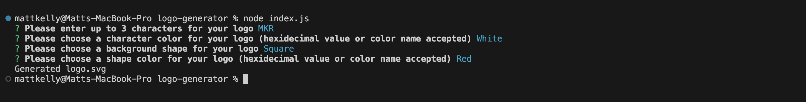

# Logo Generator

## Description
Avoid excessive graphic design turnaround times and create logos fast with this logo generator, built with Javascript, Inquirer and Jest.

To view a live demonstration of this application, please visit this link: https://www.youtube.com/watch?v=dVopQ85Pf_Q 

## Table of Contents
- [Description](#description)
- [Installation](#installation)
- [Usage](#usage)
- [Contribution](#contribution)
- [Tests](#tests)
- [License](#license)
- [Questions](#questions)

## Installation Instructions
To install this application, clone this repository to your local machine and download the Inquirer package by executing "npm install inquirer@8.2.4". Please note, Node.js must be installed on your local machine for this application to run. 

## Usage
To use this application, execute "node index.js" to start the application. Answer the prompts as requested, to create your own logo. Once you have successfully answered all prompts, a logo.svg file will be created inside your local working directory. 

</img>

</img>

## Contribution Guidelines
This project was developed by Matt Kelly.

## Tests
There are 3 tests associated with this project, located in the shapes.test.js file. These tests will verify that the shape classes (Circle, Triangle and Square) will generate accurate shape representations. These tests are written using Jest. To execute these tests, run "npm test" in your terminal.

## License

This project is not licensed. For more information regarding licences, please visit this link: https://opensource.org/license/

## Questions
Please feel free to contact me via my GitHub or email below for any questions associated with this application:  
GitHub: [mattkellyirl](https://github.com/mattkellyirl)  
Email: mattkellyvisual@gmail.com